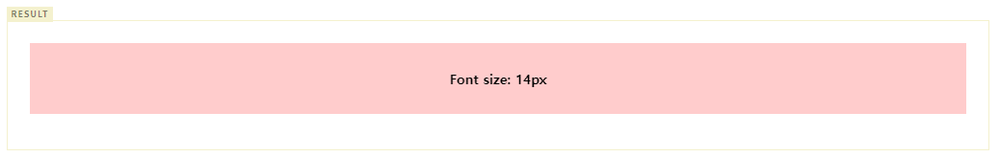
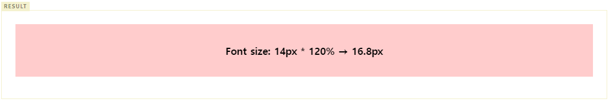
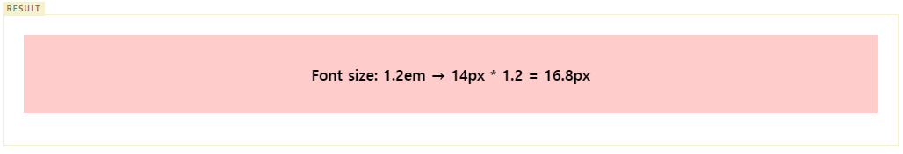
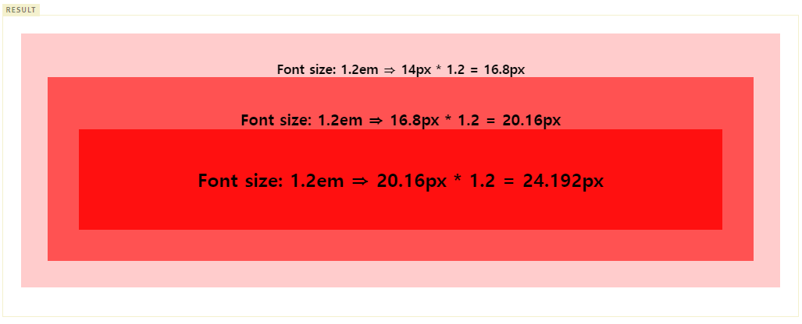
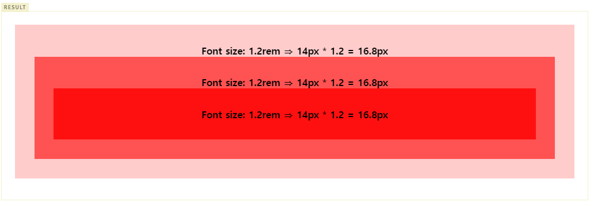
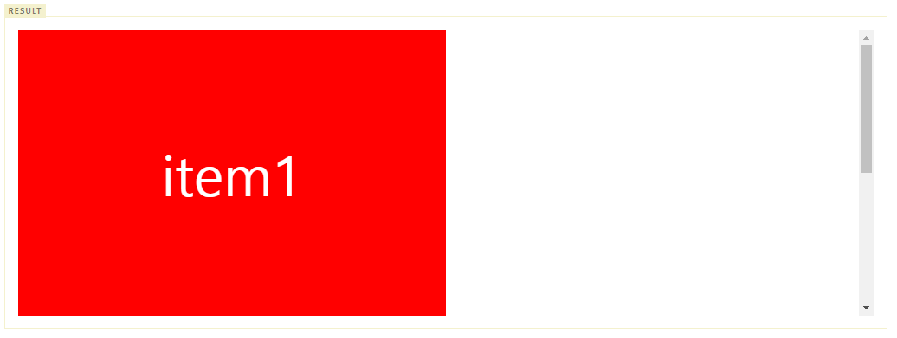
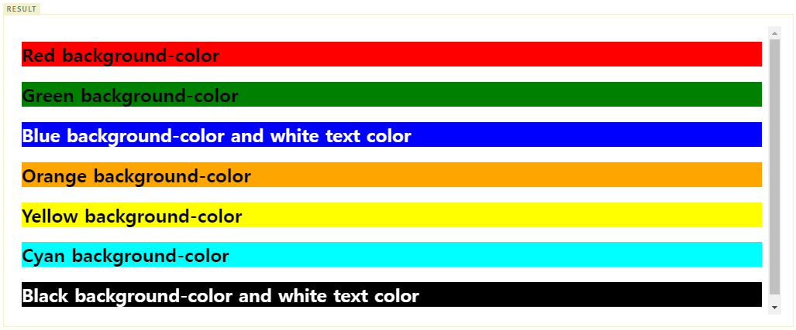
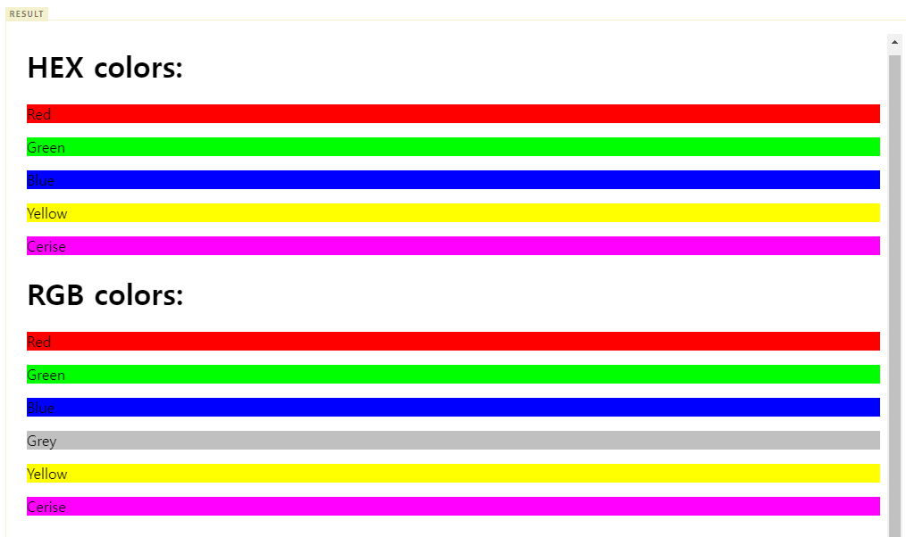
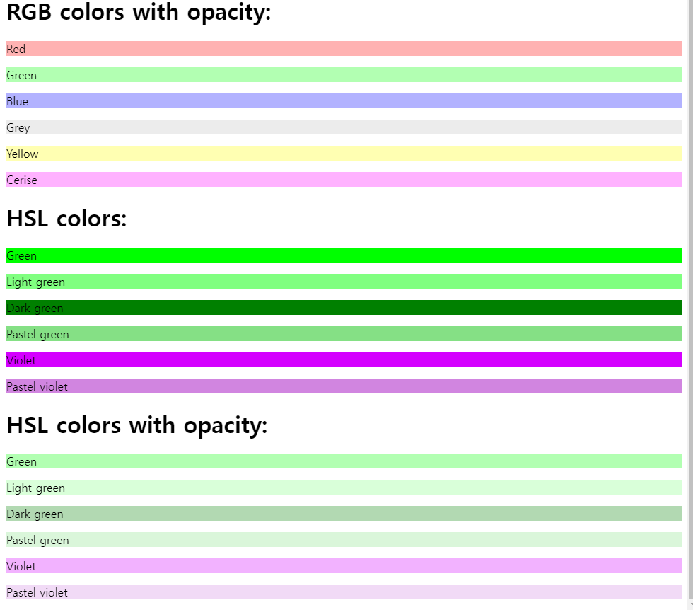

- CSS 프로퍼티에는 키워드, 크기 단위, 색상 표현 단위 등의 특정 단위를 갖는 값을 지정한다.


## 1. 키워드
- 각 프로퍼티에 따라 사용할 수 있는 키워드가 존재한다.
- 예를 들어 display 프로퍼티의 값으로 사용할 수 있는 키워드는 block, inline, inline, inline-block, none이 있다.
- 자세한 내용은 각각의 프로퍼티를 참조하기 바란다.

https://poiemaweb.com/css3-display#1-display-%ED%94%84%EB%A1%9C%ED%8D%BC%ED%8B%B0

## 2. 크기 단위
- cm, mm, inch 등의 단위도 존재하나 CSS에서 사용하는 대표적인 크기 단위는 px, em, %이다.
- px은 절대값이고 em, %는 상대값이다.
- 대부분 브라우저의 폰트 사이즈 기본값은 16px, 1em, 100%이다. 프로퍼티 값이 0인 경우, 단위를 생략할 수 있다.

### 2.1 px 
- px은 픽셀(화소)단위이다.
- 1px은 화소 1개 크기를 의미한다.
- 22인치 LCD모니터의 경우 해상도가 1680 * 1050 인데 이것은 가로에 1680개의 픽셀, 세로에 1050개의 픽셀을 가진다는 의미이다.
- 200만 화소(픽셀)의 디지털 카메라로 찍은 사진은 1600 * 1200 = 1,920,000으로 통상 200만 화소라 한다.


- 픽셀은 디바이스 해상도에 따라 상대적인 크기를 갖는다.


- 이와 같이 디바이스 별로 픽셀(화소)의 크기는 제각각이기 때문에 픽셀을 기준으로 하는 단위는 명확하지 않다. 
- 따라서 대부분의 브라우저는 1px을 1/96인치의 절대 단위로 인식한다.
- px은 요소의 크기나 이미지의 크기 지정에 주로 사용된다.

```html
<!DOCTYPE html>
<html>
<head>
  <style>
    body {
      text-align: center;
    }
    div {
      font-size: 14px;
      font-weight: bold;
      padding: 2em; /* 14px * 2 = 28px */
      background-color: rgba(255, 0, 0, 0.2);
    }
  </style>
</head>
<body>
  <div>Font size: 14px</div>
</body>
</html>
```



### 2.2 %
- %는 백분률 단위의 상대 단위이다. 
- 요소에 지정된 사이즈(상속된 사이즈나 디폴트 사이즈)에 상대적인 사이즈를 설정한다.

```html
<!DOCTYPE html>
<html>
<head>
  <style>
    body {
      font-size: 14px;
      text-align: center;
    }
    div {
      font-size: 120%; /* 14px * 1.2 = 16.8px */
      font-weight: bold;
      padding: 2em;    /* 16.8px * 2 = 33.6px */
      background-color: rgba(255, 0, 0, 0.2);
    }
  </style>
</head>
<body>
  <div>Font size: 14px * 120% → 16.8px</div>
</body>
</html>
```



### 2.3 em
- em은 배수 단위로 상대단위이다. 
- 요소에 지정된 사이즈(상솓괸 사이즈나 디폴트 사이즈)에 상대적인 사이즈를 설정한다.
- 예를 들어 1em은 요소에 지정된 사이즈와 같고 2em은 요소에 지정된 사이즈의 2배이다.
- 폰트 사이즈 설정이나 콘텐츠를 포함하는 컨테이너의 크기 설정에 사용하면 상대적인 설정이 가능하여 편리하다.

```html
<!DOCTYPE html>
<html>
<head>
  <style>
    body {
      font-size: 14px;
      text-align: center;
    }
    div {
      font-size: 1.2em; /* 14px * 1.2 = 16.8px */
      font-weight: bold;
      padding: 2em;     /* 16.8px * 2 = 33.6px */
      background-color: rgba(255, 0, 0, 0.2);
    }
  </style>
</head>
<body>
  <div>Font size: 1.2em → 14px * 1.2 = 16.8px</div>
</body>
</html>
```



- 중첩된 자식 요소에 em을 지정하면 모든 자식 요소의 사이즈에 영향을 미치기 때문에 주의하여야 한다.

```html
<!DOCTYPE html>
<html>
<head>
  <style>
    body {
      font-size: 14px;
      text-align: center;
    }
    div {
      font-size: 1.2em; /* 14px * 1.2 = 16.8px */
      font-weight: bold;
      padding: 2em;
    }
    .box1 { background-color: rgba(255, 0, 0, 0.2); }
    .box2 { background-color: rgba(255, 0, 0, 0.6); }
    .box3 { background-color: rgba(255, 0, 0, 0.8); }
  </style>
</head>
<body>
  <div class='box1'>
    Font size: 1.2em ⇒ 14px * 1.2 = 16.8px
    <div class='box2'>
      Font size: 1.2em ⇒ 16.8px * 1.2 = 20.16px
      <div class='box3'>
        Font size: 1.2em ⇒ 20.16px * 1.2 = 24.192px
      </div>
    </div>
  </div>
</body>
</html>
```



- 의도되지 않은 상황이라면 무척 난감한 상황일 수 있다. 즉, 상대 단위인 em의 기준이 상속의 영향으로 바뀔 수 있기 때문이다.

### 2.4 rem
- em의 기준은 상속의 영향으로 바뀔 수 있다. 즉, 상황에 따라 1.2em은 각기 다른 값을 가질 수 있다.
- rem은 최상위 요소(html)의 사이즈를 기준으로 삼는다. rem의 r은 root를 의미한다.

```html
<!DOCTYPE html>
<html>
<head>
  <style>
    html {
      font-size: 14px;
      /* font-size 미지정 시에는 16px */
    }
    div {
      font-size: 1.2rem; /* html font-size: 14px * 1.2 = 16.8px */
      font-weight: bold;
      padding: 2em;
      text-align: center;
    }
    .box1 { background-color: rgba(255, 0, 0, 0.2); }
    .box2 { background-color: rgba(255, 0, 0, 0.6); }
    .box3 { background-color: rgba(255, 0, 0, 0.8); }
  </style>
</head>
<body>
  <div class='box1'>
    Font size: 1.2rem ⇒ 14px * 1.2 = 16.8px
    <div class='box2'>
      Font size: 1.2rem ⇒ 14px * 1.2 = 16.8px
      <div class='box3'>
        Font size: 1.2rem ⇒ 14px * 1.2 = 16.8px
      </div>
    </div>
  </div>
</body>
</html>
```



- 사용자가 브라우저의 기본 폰트 크기를 변경(Mac Chrome의 경우, 설정 > 고급 설정 표시 > 웹 콘텐츠 > 글꼴 맞춤 설정)하더라도 
이에 따라 웹사이트의 레이아웃을 적절히 조정할 수 있다는 장점이 있다. 
- 따라서 폰트 사이즈 뿐만이 아니라 콘텐츠의 크기에 따라 가변적으로 대응하여야 하는 wrapper 요소(container) 등에 적합하다.

```css
.container {
  width: 70rem; /* 70rem ⇒ 14px * 70 = 980px */
}
```

- Reset CSS를 사용하여 사전에 html 요소의 font-size 지정이 필요하다.
- font-size 미지정 시에는 16px가 적용된다.

### 2.5 Viewport 단위(vh, vw, vmin, vmax)
- 반응형 웹디자인은 화면의 크기에 동적으로 대응하기 위해 % 단위를 자주 사용한다. 
- 하지만 % 단위는 em과 같이 상속에 의해 부모 요소에 상대적 영향을 받는다.
- Viewport 단위는 상대적인 단위로 viewport를 기준으로 한 상대적 사이즈를 의미한다.

|단위	|Description|
|---|---|
|vw	|viewport 너비의 1/100|
|vh	|viewport 높이의 1/100|
|vmin	|viewport 너비 또는 높이 중 작은 쪽의 1/100|
|vmax	|viewport 너비 또는 높이 중 큰 쪽의 1/100|

- 예를 들어 viewport 너비가 1000px, 높이가 600px인 경우,
  - 1vw : viewport 너비 1000px의 1%인 10px
  - 1vh : viewport 높이 600px의 1%인 6px
  - vmin : viewport 높이 600px의 1%인 6px
  - vmax : viewport 너비 1000px의 1%인 10px

```html
<!DOCTYPE html>
<html>
<head>
  <style>
    body { margin: 0px; }
    .item {
      width: 50vw;
      height: 100vh;
      text-align: center;
      line-height: 100vh;
      font-size: 4rem;
      color: white;
    }
    .item1 { background-color: red; }
    .item2 { background-color: orange; }
  </style>
</head>
<body>
  <div class='item item1'>item1</div>
  <div class='item item2'>item2</div>
</body>
</html>
```



- IE 8 이하는 지원하지 않으며 IE 9~11, Edge는 지원이 완전하지 않으므로 주의가 필요하다.

## 3. 색상 표현 단위
- 색상을 지정하기 위해 키워드(red, blue…)를 사용할 수 있다. 사용이 간편하다는 장점이 있으나 표현할 수 있는 색상의 수는 제한된다.
- 색상를 표현할 수 있는 키워드 리스트는 W3C css3-color를 참고하기 바란다.

```html
<!DOCTYPE html>
<html>
  <body>
    <h2 style="background-color:red">
    Red background-color
    </h2>

    <h2 style="background-color:green">
    Green background-color
    </h2>

    <h2 style="background-color:blue;color:white">
    Blue background-color and white text color
    </h2>

    <h2 style="background-color:orange">
    Orange background-color
    </h2>

    <h2 style="background-color:yellow">
    Yellow background-color
    </h2>

    <h2 style="background-color:cyan">
    Cyan background-color
    </h2>

    <h2 style="background-color:black;color:white">
    Black background-color and white text color
    </h2>
  </body>
</html>
```



- 더욱 다양한 색상을 표현하기 위해 다음과 같은 색상 표현 단위를 사용할 수 있다. HTML COLOR CODES를 참조하면 편리하다.

|단위	|사용예|
|---|---|
|HEX 코드 단위 (Hexadecimal Colors)	|#000000|
|RGB (Red, Green, Blue)	|rgb(255, 255, 0)|
|RGBA (Red, Green, Blue, Alpha/투명도)	|rgba(255, 255, 0, 1)|
|HSL (Hue/색상, Saturation/채도, Lightness/명도)	|hsl(0, 100%, 25%)|
|HSLA (Hue, Saturation, Lightness, Alpha)	|hsla(60, 100%, 50%, 1)|

```html
<!DOCTYPE html>
<html>
  <head>
    <style>
      #hex-p1 {background-color:#ff0000;}
      #hex-p2 {background-color:#00ff00;}
      #hex-p3 {background-color:#0000ff;}
      #hex-p4 {background-color:#ffff00;}
      #hex-p5 {background-color:#ff00ff;}

      #rgb-p1 {background-color:rgb(255,0,0);}
      #rgb-p2 {background-color:rgb(0,255,0);}
      #rgb-p3 {background-color:rgb(0,0,255);}
      #rgb-p4 {background-color:rgb(192,192,192);}
      #rgb-p5 {background-color:rgb(255,255,0);}
      #rgb-p6 {background-color:rgb(255,0,255);}

      #rgba-p1 {background-color:rgba(255,0,0,0.3);}
      #rgba-p2 {background-color:rgba(0,255,0,0.3);}
      #rgba-p3 {background-color:rgba(0,0,255,0.3);}
      #rgba-p4 {background-color:rgba(192,192,192,0.3);}
      #rgba-p5 {background-color:rgba(255,255,0,0.3);}
      #rgba-p6 {background-color:rgba(255,0,255,0.3);}

      #hsl-p1 {background-color:hsl(120,100%,50%);}
      #hsl-p2 {background-color:hsl(120,100%,75%);}
      #hsl-p3 {background-color:hsl(120,100%,25%);}
      #hsl-p4 {background-color:hsl(120,60%,70%);}
      #hsl-p5 {background-color:hsl(290,100%,50%);}
      #hsl-p6 {background-color:hsl(290,60%,70%);}

      #hsla-p1 {background-color:hsla(120,100%,50%,0.3);}
      #hsla-p2 {background-color:hsla(120,100%,75%,0.3);}
      #hsla-p3 {background-color:hsla(120,100%,25%,0.3);}
      #hsla-p4 {background-color:hsla(120,60%,70%,0.3);}
      #hsla-p5 {background-color:hsla(290,100%,50%,0.3);}
      #hsla-p6 {background-color:hsla(290,60%,70%,0.3);}
    </style>
  </head>

  <body>
    <h1>HEX colors:</h1>
    <p id="hex-p1">Red</p>
    <p id="hex-p2">Green</p>
    <p id="hex-p3">Blue</p>
    <p id="hex-p4">Yellow</p>
    <p id="hex-p5">Cerise</p>

    <h1>RGB colors:</h1>
    <p id="rgb-p1">Red</p>
    <p id="rgb-p2">Green</p>
    <p id="rgb-p3">Blue</p>
    <p id="rgb-p4">Grey</p>
    <p id="rgb-p5">Yellow</p>
    <p id="rgb-p6">Cerise</p>

    <h1>RGB colors with opacity:</h1>
    <p id="rgba-p1">Red</p>
    <p id="rgba-p2">Green</p>
    <p id="rgba-p3">Blue</p>
    <p id="rgba-p4">Grey</p>
    <p id="rgba-p5">Yellow</p>
    <p id="rgba-p6">Cerise</p>

    <h1>HSL colors:</h1>
    <p id="hsl-p1">Green</p>
    <p id="hsl-p2">Light green</p>
    <p id="hsl-p3">Dark green</p>
    <p id="hsl-p4">Pastel green</p>
    <p id="hsl-p5">Violet</p>
    <p id="hsl-p6">Pastel violet</p>

    <h1>HSL colors with opacity:</h1>
    <p id="hsla-p1">Green</p>
    <p id="hsla-p2">Light green</p>
    <p id="hsla-p3">Dark green</p>
    <p id="hsla-p4">Pastel green</p>
    <p id="hsla-p5">Violet</p>
    <p id="hsla-p6">Pastel violet</p>
  </body>
</html>
```




### 3.1 Color keywords
- google 검색 참조
- https://poiemaweb.com/css3-units

참고 : 

https://poiemaweb.com/css3-units

https://www.w3.org/TR/CSS/

https://quirksmode.org/css/units-values/


