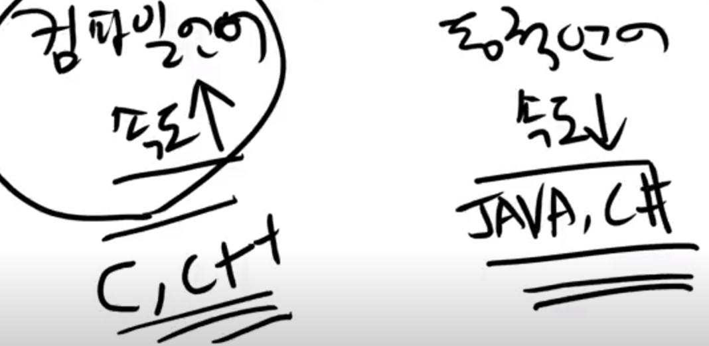
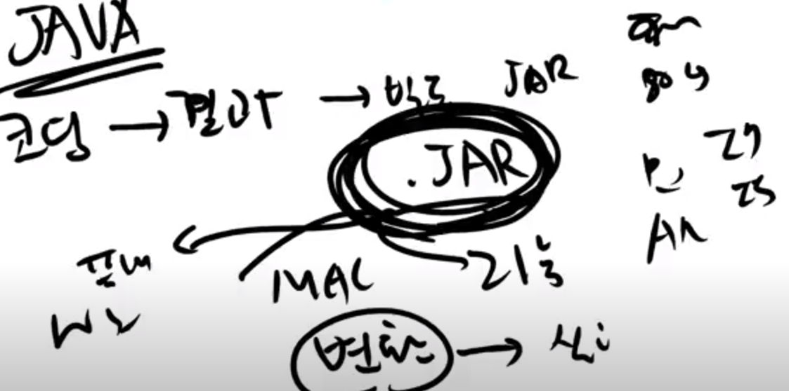
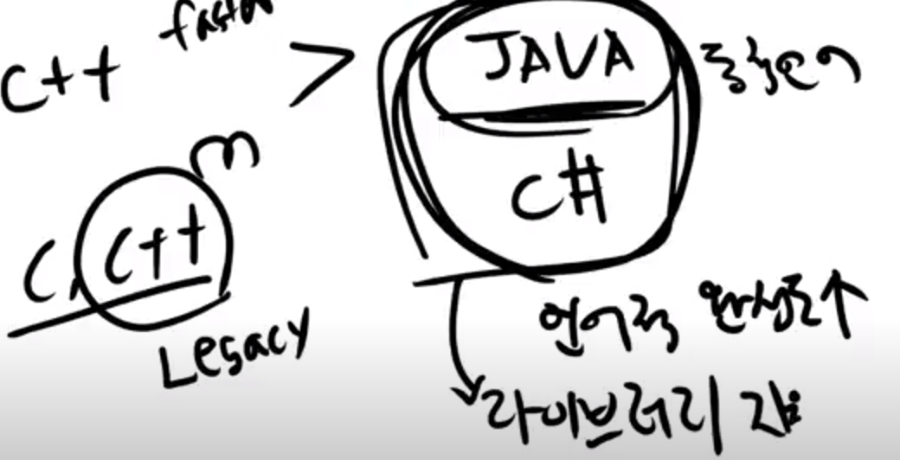
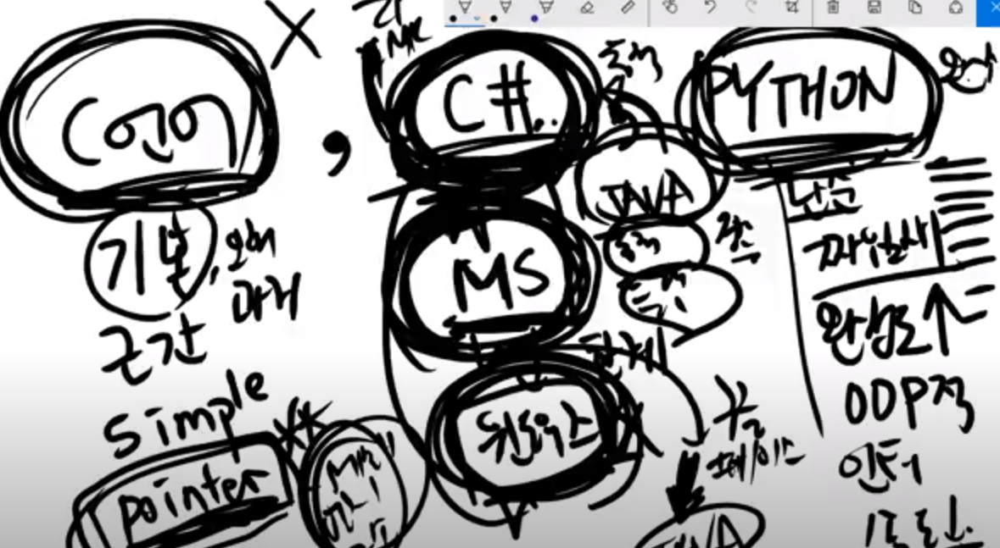

## 컴파일언어와 동적언어

- 프로그래머가 코딩 -> 빌드(컴파일러가 변환) -> 실행파일

- 문서를 컴파일러를 통해 기계어로 변환

- 동적언어는 코딩을 하고 빌드(할수도 안할수도) -> 중간문서(실행하는 도중에 변환한다.)

- 컴파일언어는 속도가 빠르다 동적언어는 속도가 느리다.
- 왜 동적언어가 생겼을까?

## 동적언어가 나온 이유

- 플랫폼 별 다른 변환 필요
- 윈도우즈에서 스타 실행, MAC에서 스타실행 -> 두개는 다르다
- 빌드 복사 실행
- 어셈블리어로 ADD 3,4를 기계어로 바꿀때 OPCODE
  - ADD는 0001
  - SUB는 0002
  - MUL는 0003

- 근데 칩셋제조사마다 이 OPCODE가 다르다
- 코딩의 변환과정이 칩셋마다 다르게 동작한다.
- 만약 이 프로그램이 인텔의 칩셋에서만 돌아간다면 문제없을수도 있지만
- 심지어 인텔에서만 돌아간다해도 시간이 지남에 따라 OPCODE가 생기기도 없어지기도 한다.

- 예를들면 펜티엄 MMX는 실수 연산기가 하나 더 들어가 부동소수점 연산이 가능해졌다.
- 이는 새로운 OPCODE가 생긴거고 이걸 쓰면 더 빨라진다.
- 기술이 진화하며 변환이 달라져야 속도가 빨라진다.

- 컴파일러 입장에서는 CPU, OS 별로 변환과정이 달라졌다. 매우 힘든과정
- 그래서 옛날에는 윈도우 인텔에서만 실행가능하다 못박아뒀다.
- 이런 시기에 동적언어가 나왔다. 프로그램언어문서를 실행할때 플랫폼마다 동적으로 실행하자

- java 코딩 -> 결과 -> 빌드 .jar가 나오는데 이게 플랫폼마다 다르게 동작한다.
- java, c# 은 언어적 완성도가 좋다, 라이브러리도 지원이 많다.

- c, c++보다는 생산성면에서 java나 c#이 좋다.
- c++로 만든, java로 만든 웹서버를 비교하면 java가 더 빠르다는 결과가 있다. 
- 기본, 근간이 되는 파일들은 c,c++인 경우가 많다.
- 언어는 각각의 용도가 다르다.

## 첫언어

- c언어 -> 기본, 근간, simple하다, pointer(메모리 번지, 구조)
- c# -> MS가 만든언어, 태생적으로 한계가 있다.
  - 윈도우즈에서밖에 안된다. -> 이제는 리눅스, 맥 둘 다 된다.
- python -> 단순, 짜임새, 완성도 좋음
  - 완전한 인터프리터이므로 속도가 조금 더 떨어진다.
- javascript -> HOT, 자연발생, 완성도가 조금 떨어진다.
