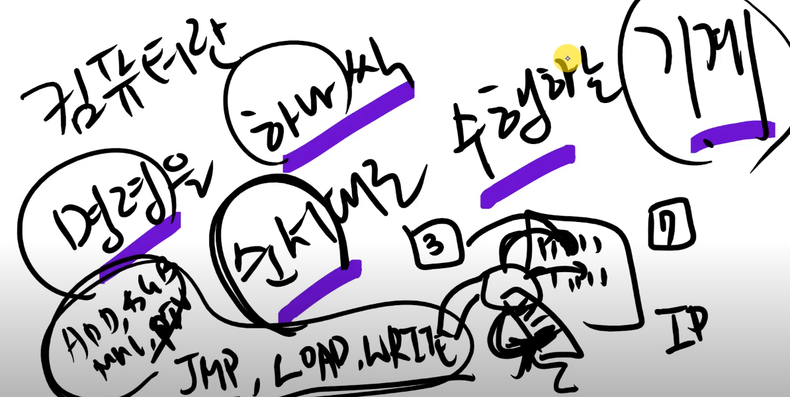
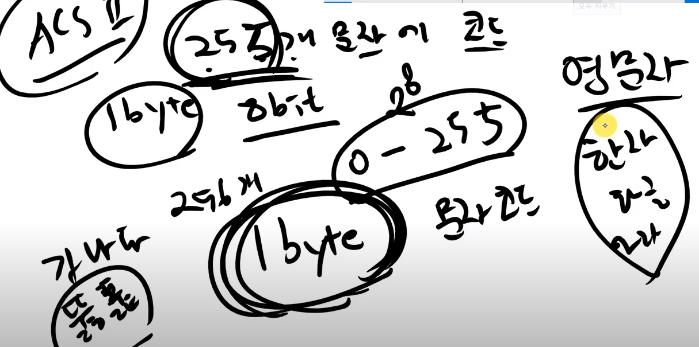
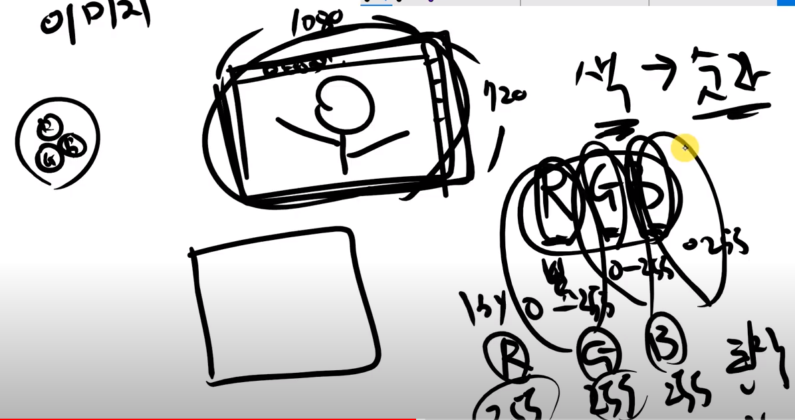
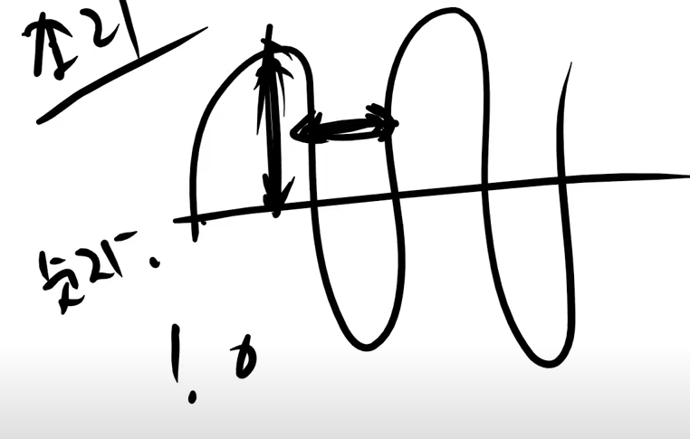
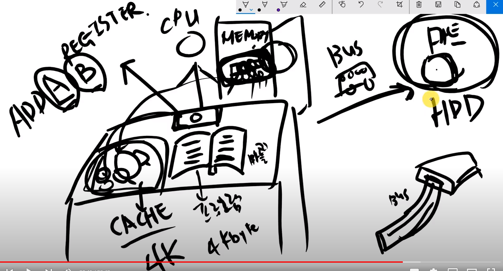
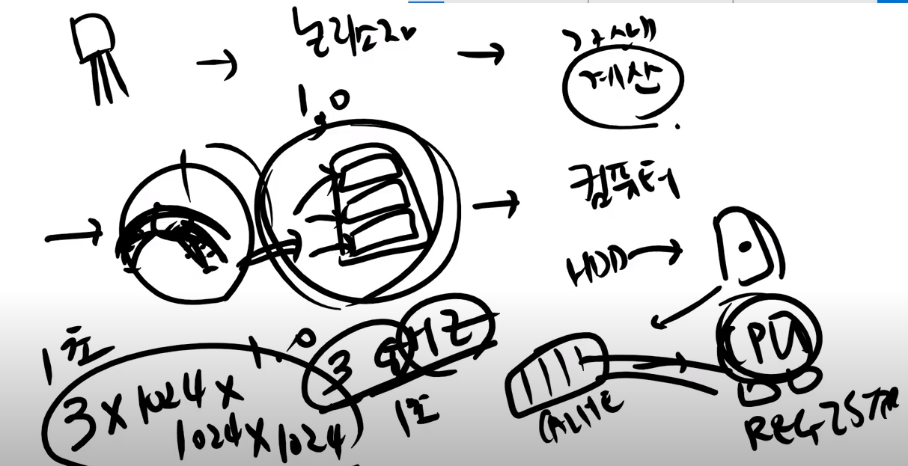

## 컴퓨터란 명령을 하나씩 순서대로 수행하는 기계

- ADD, SUB, MUL, PIV, JMP, LOAD, WRITE 같은 명령들 
- 쿼드코어는 명령을 4개 수행할 수 있다는 뜻
- 종이에 적힌 명령 하나씩 순서대로 수행한다.
- 컴퓨터는 기계이다. AI는 프로그램이다.
- 어떤 명령을 어떤 순서로 수행할지를 적어놓은게 프로그램이다!
- 프로그램언어는 수행할지를 적는 방식들
- 그림, 음악, 문자 문자는 숫자로 표현할 수 있다.

- ACSII 영문자를 숫자로 대칭해둔것 -> 255개 문자를 코드로 표현한다.
- 255인 이유는 8bit가 0~255이므로 1byte=8bit 255개를 표현한다. 
- 이 255가 한계라 unicode가 나왔다. = 2byte 매우 많음
- 이미지는 1080 * 720 의 픽셀로 나타내는것 
- 색 -> 숫자, RGB만 있으면 모든색을 표현할 수 있다.

- RGB(255, 255, 255)는 3byte로 표현할 수 있다.

- 소리도 숫자로 표현할 수 있다. 진폭과 파장을 통해 숫자로 표현한다.
- 컴퓨터는 ADD, SUB로 이 많은 것을 다 표현한다.

## 요리에 비유해보자

- 레시피가 있어야한다.(책, 요리하는 방법, 지침, 프로그램!)
- 요리재료, 마트, 버스
- 마트는 HDD 하드디스크이다. 
- 마트(하드디스크)에 가려면 버스를 타야하는데 이때 실제로 BUS를 사용한다.
- 하드디스크에 시리얼포트로 연결되어있는데 이게 BUS임 
- 사오면 냉장고에 넣어두는데 이 냉장고가 메모리이다.
- 요리하는 사람은 CPU이다. 
- 마늘과 닭을 탁자에 꺼내 둔게 캐시이다.
- 캐시의 크기는 4K바이트 정도 된다.
- 이제 닭을 도마에 두는데 이 도마가 레지스터이다.
- 요리하던 도중에 마트에 가는 일이 있을 수도 있다.
- 웬만하면 냉장고에 처음에 다 갖다두고 그 다음 캐시에 두고 레지스터두고 한다.

## 다시 정리하면

- 트랜지스터
- 논리소자
- 계산기
- 폰노이만, 종이
- 메모리와 프로그램을 합치자
- 컴퓨터가 수행되는 원리
  - HDD, 메모리, 캐시, 레지스터
  - 컴퓨터는 단지 되게 단순한 계산을 엄청나게 빠르게 할 뿐이다.
