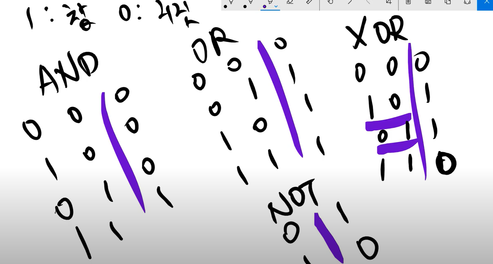
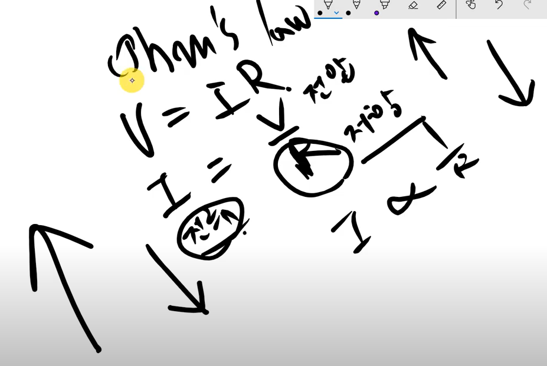
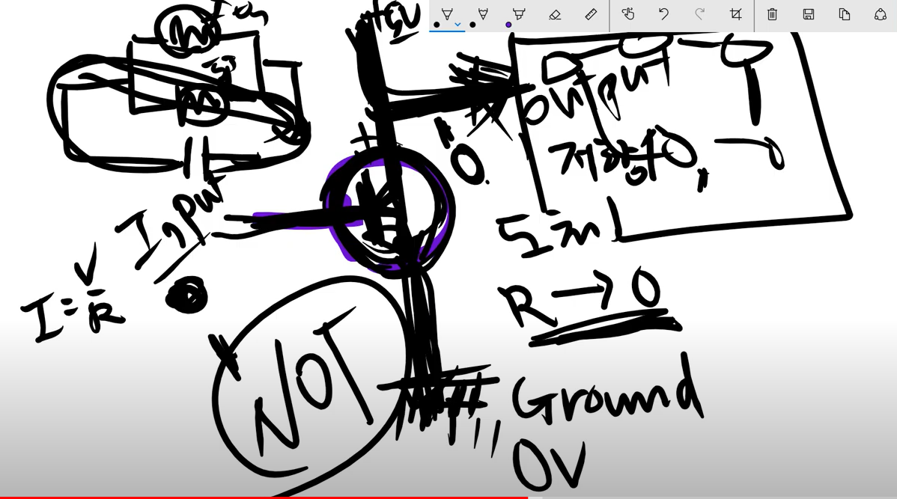
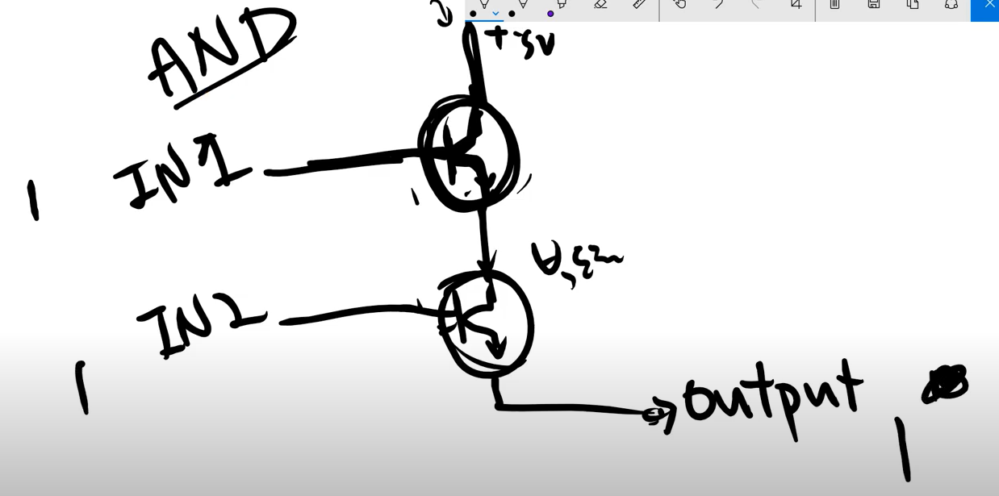
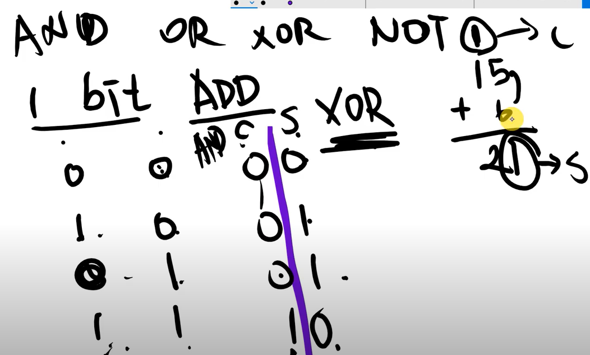
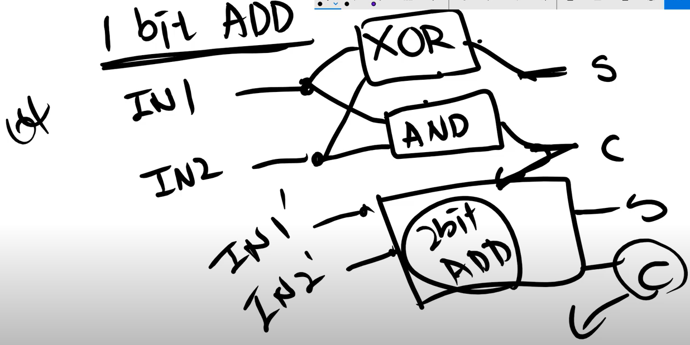

- 트랜지스터를 기호로 나타내자
- p부분 베이스에 전압이 걸리느냐 안걸리느냐로 전류가 흐르는지 안흐르는지 알 수 있다.
- 부울대수를 이용해보다.

- AND, OR, XOR, NOT 을 트랜지스터로 만들 수 있다.
- 인풋은 베이스로 들어가고 vcc는 5v가 들어간다.
- not게이트를 이해하기 위해선 간단한 회로지식을 알아야 한다.

- 옴의법칙 전류는 저항에 반비례한다. 
- 도체(저항이 0에 수렴한다.), 부도체(저항이 무한대에 수렴한다.)
- 트랜지스터가 반도체이다.전압이 안가해지면 부도체이고 전압이 가해지면 도체가 된다.
- not게이트는 인풋전압이 0이면 다 5v에서 output으로 흐른다.

- 인풋전압이 1이면 길이 열리고 그 길인 트랜지스터로 다 빠져나가서 아웃풋이 0이된다. 그래서 not게이트가 성립된다.
- and게이트는 트랜지스터 두개로 만든다.
- 인풋 1, 인풋 2 베이스에 입력을 두 개 걸어준다.

- 한쪽이 1이고 0이면 전류는 흐르지 않는다. 두 개의 길이 다 열려야 한다.
- OR과 XOR도 마찬가지 방식으로 만들 수 있다.
- 논리소자로 어떻게 계산기가 되느냐

- 1bit 가산기 AND와 XOR를 이용해서 만들수 있다.
- C-> carry 올림수
- S-> sum 합

- c 를 다음 1비트 가산기의 입력으로 넣는다. 
- 다음비트 가산기는 입력이 3개가 들어가는 가산기이다.
- 그래서 첫번째 비트 가산기는 입력이 2개라서 반가산기라고 부르고 두번째 비트 이후 가산기는 입력이 3개라서 전가산기라고 부른다.
- 이렇게 1비트짜리 가산기를 연결하면 4비트 가산기도 만들수있고 64비트 가산기도 만들수 있다.
- 트랜지스터 -> 논리소자 -> 가산기, 감산기, 곱셈, 나눗셈-> 계산기 만들기가 가능하다.
- 계산기를 이용해서 컴퓨터를 만든다. 프로그램을 만들 수 있어야한다!
