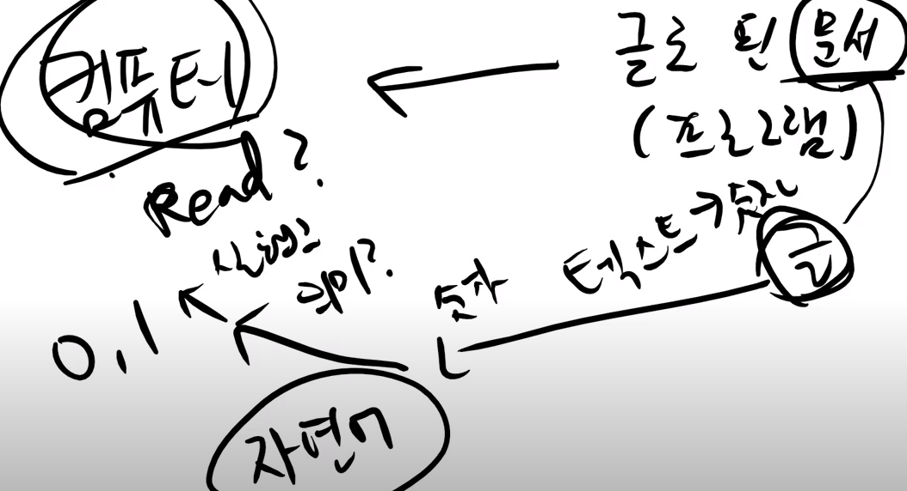
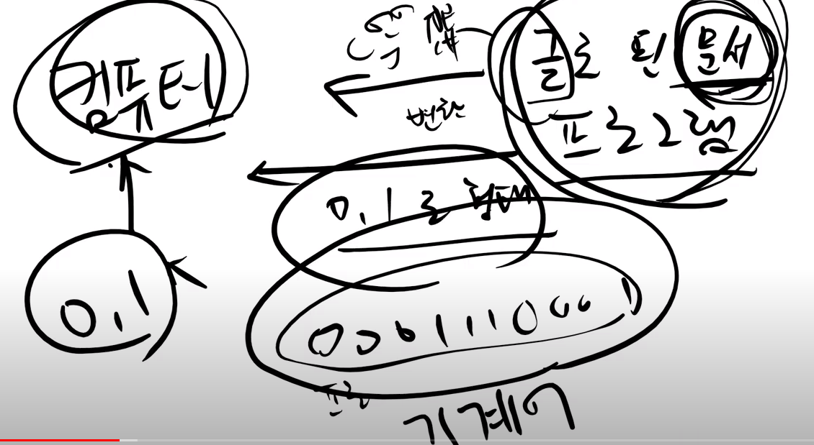
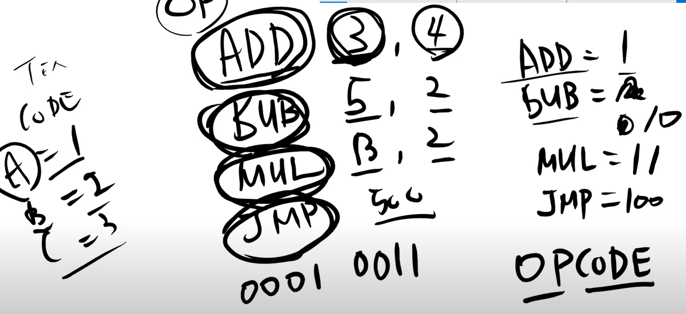
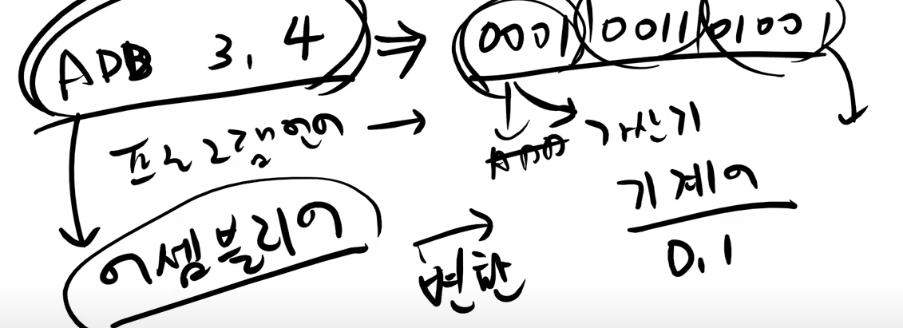
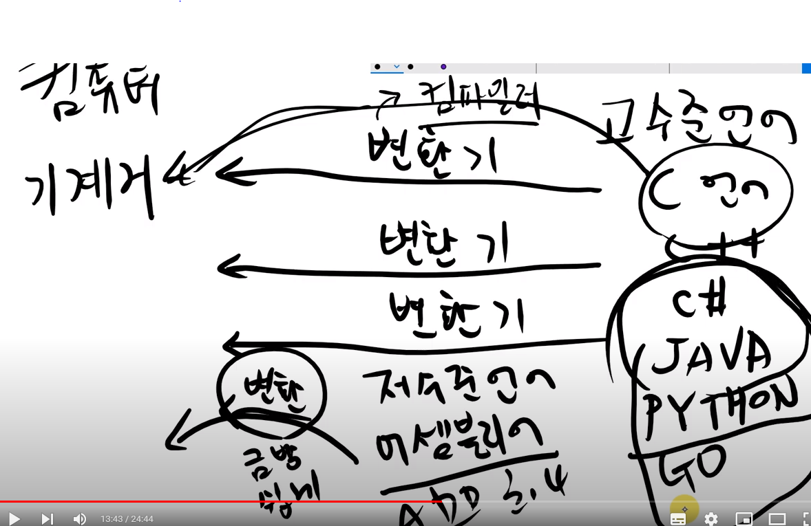
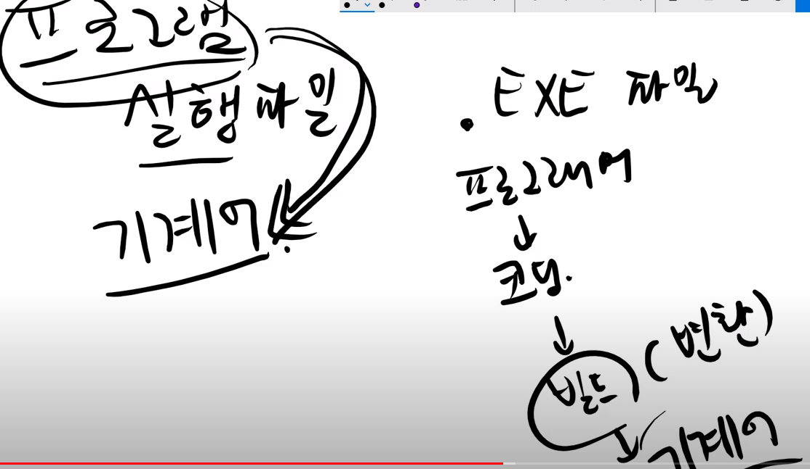
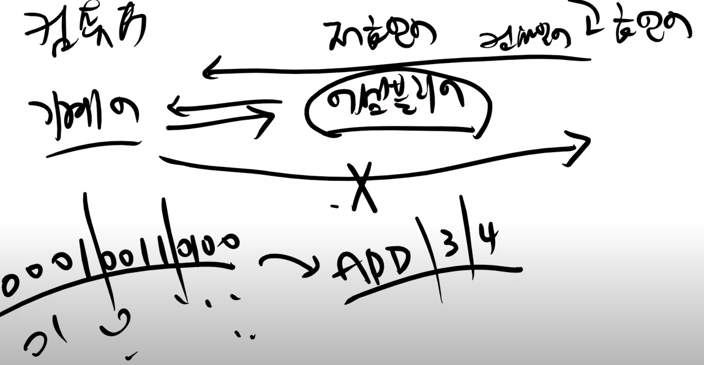
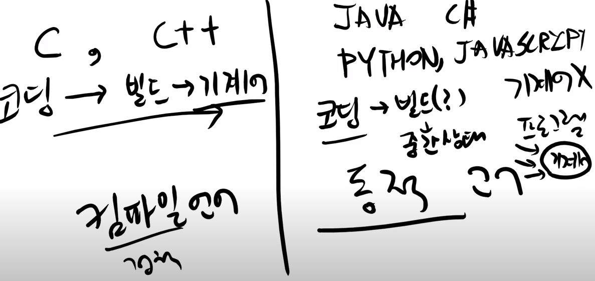

## 프로그램이란?

- 명령과 순서를 쓴 문서
- 이 문서가 어떤 글로 쓰여있냐? -> 프로그래밍언어
- 컴퓨터는 글로 된 문서(프로그램)을 받는다. 

- 컴퓨터는 글로 된 문서를 읽을 수 있는가?
- 컴퓨터가 글을 숫자로 바꿔서 그 숫자에서 의미를 찾아서 실행시키는 것인가? 아니다
- 글로 된 문서를 변환하는 과정이 필요하다.

- 프로그램 언어가 변환돼서 0,1 되면 그게 기계어이다.
- 명령어와 데이터가 있다.
 

- OP(명령어) 어떤 명령어에다가 숫자를 대입한다. -> 이것이 OPCODE (명령어를 해석)

- ADD 3,4 -> 0001 0011 0100 -> 가산기 로 3,4를 더하는 구나
- 인간이 알아볼 수 있는 언어를 기계어로 바꾸는 변환과정이 필요하다.

## 언어 변환 장치(컴파일러)
- 인간언어, 한국어, 영어, 일본어 를 돌고래에게 변환해주는 과정이 필요하다.
- 이게 돌고래가 아니라 컴퓨터라면?

- 컴퓨터는 기계어를 알아 듣는다. 
- 고수준언어 -> C언어, C++, C#, java, python, go
- 저수준언어 -> 어셈블리어 (ADD 3,4)
- 변환기는 컴파일러이다. 컴파일러가 고수준언어,저수준언어를 기계어로 바꾸어준다.

- 프로그램이라는 건 실행파일 -> exe파일
- 실행되기 위해서는 기계어로 변환해야된다.
- 프로그래머 -> 코딩 -> 빌드(변환) -> 기계어

- 역변환도 가능하다. 기계어를 고급언어로 바꾸는건 어렵지만 기계어를 어셈블리어로 바꾸는것은 할만하다.
- 기계어를 어셈블리어로 볼 수 있다.
- 해커들은 기계어만 가지고 어떤 프로그램을 고칠 수 있다.
- 게임에서 순간이동 핵, 이동 핵을 만든다.

## 프로그램 언어
- c, c++
- java, c#, python, javascript

- 이 두가지 분류는 컴파일러언어(정적)와 동적언어로 나뉜다.
- 정적 : 코딩 -> 빌드 -> 기계어
- 동적 : 코딩 -> 빌드(할지도 안할지도) -> 중간상태 , 기계어 x
- 컴파일러언어는 돈까스를 한번에 다 자르고 먹는것 -> 속도가 빠르다
- 동적언어는 돈까스를 한번씩 자르고 먹는것 -> 속도가 느리다
