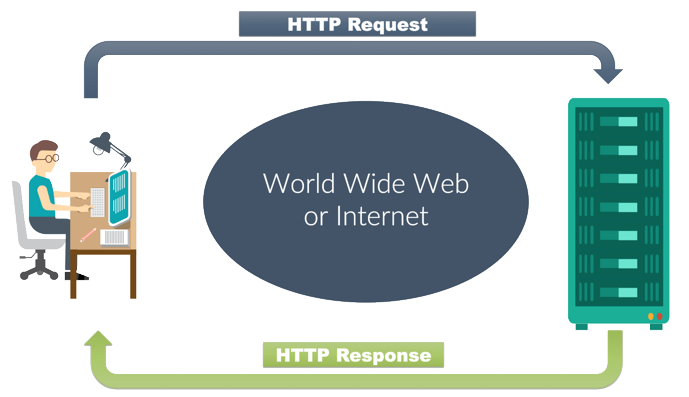
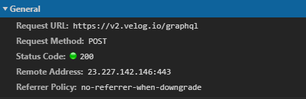
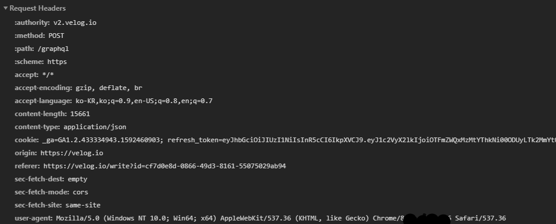
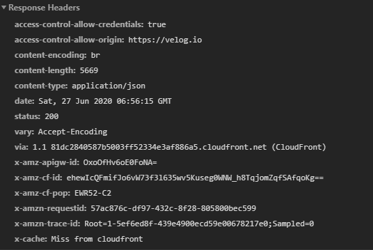
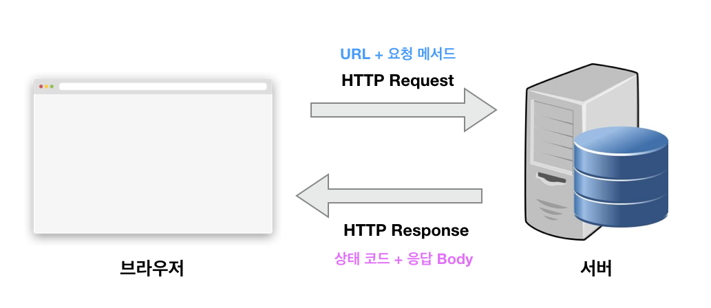

## HTTP란?
* 정보가 흐르는 곳이라면 언제나 효율적인 교류를 위한 규칙이 존재합니다.
* 예를 들면 주식시장에서의 이름, 계좌, 거래일자, 금액 등의 규칙을 지켜 거래하는 것입니다.
* HTTP란 HTML(웹문서를 만들기 위한 언어) 문서를 주고 받는데 쓰이는 통신프로토콜(통신규약)이며, TCP와 UDP를 사용하여 통신하며 80번
포트를 사용하는 통신프로토콜(통신규약)입니다.
* 웹에서는 브라우저와 서버간에 데이터를 주고받기 위한 방식으로 HTTP프로토콜을 사용하고 있습니다.

## 통신프로토콜
* 통신규약이라고도 하며 컴퓨터나 원거리 통신 장비 사이에서 메세지를 주고 받는 양식과 규칙의 체계입니다.
* 이는 신호체계, 인증, 오류감지 기능을 포함할 수 있습니다.
* 구성은 물리적측면(매체, 단자, 전송신호, 회선규격) 과 논리적측면(자료 형식 단위, 자료 전송 절차) 로 이루어집니다.

## HTTP 특징
* HTTP 메세지는 서버와 클라이언트에 의해 해석됩니다.
* TCP/IP를 이용하는 응용프로토콜입니다.
* HTTP는 연결상태를 유지하지 않는, 상태가 없는(stateless) 비연결성 프로토콜입니다. 상태가 없다는 말은 클라이언트가 이전에 요청한
내용을 기억하고 있지 않는다라는 것이며 좀 더 쉽게 말하면 데이터를 주고 받기 위한 각각의 데이터 요청이 서로 독립적으로 관리가 되어
이전 데이터 요청과 다음 데이터 요청이 서로 관련이 없다는 말입니다.
* 이런 특징 때문에 서버는 세션과 같은 별도의 추가 정보를 관리하지 않아도 되고, 다수의 요청 처리 및 서버의 부하를 줄일 수 있는
성능 상의 이점이 생깁니다.
* 한편 이런 비연결성의 단점을 해결하기 위해 cookie 와 session이 등장했습니다.
* 또한 비연결성 프로토콜이기 때문에 요청/응답 방식으로 동작합니다.
* 도메인 + 자원위치(URL), 도메인 + 자원의 식별자(URI) 를 통해서 요청을 하고, 서버가 요청에 따른 HTML 문서응답을 해줍니다.
* URL(Uniform Resource Locators)은 개발자가 아니더라도 이미 우리에게 익숙한 용어입니다. 
서버에 자원을 요청하기 위해 입력하는 영문 주소죠. 
아무래도 숫자로 되어 있는 IP 주소보다는 훨씬 기억하기 쉽기 때문에 사용하는 것 같습니다.


* HTTP 가 전체 인터넷 프로토콜에서 위치하는 곳은 응용계층입니다.
  * 응용 계층 (DNS, FTP, HTTP)
  * 전송 계층 (TCP,UDP,SCTP)
  * 네트워크 계층 (IP,ARP,RARP)
  * 링크 계층 (이더넷, WIFI, 토큰링)

## HTTP 통신과정(요청과 응답)
```
1. 클라이언트(사용자)가 서버에 HTTP Request (요청)을 한다.
2. 서버가 사용자의 요청을 받고 HTTP Response (응답)을 한다.
```



* 클라이언트란 요청을 보내는 쪽을 의미하며 일반적으로 웹 관점에서는 브라우저를 의미합니다.
* 서버란 요청을 받는 쪽을 의미하며 일반적으로 데이터를 보내주는 원격지의 컴퓨터를 의미합니다.

## HTTP Rqquest(요청) 메시지
* 요청은 웹브라우저의 URL을 통해 어느 웹사이트(도메인)의 어느 경로에 있는 페이지를 요청할지 나타내는 행위입니다.

```
Request-Line
*(( general-header | request-header | entity-header ) CRLF)
CRLF
[ message-body ]
```


1.  Request-Line
  
Request-Line, URL정보, 요청방식(Method), HTTP버전정보제공 의 규칙입니다.
아래 그림에서는 Request URL, Request Method 를 나타내고 있습니다.



2. *(( general-header | request-header | entity-header ) CRLF)

헤더정보 , 헤더에는 요청하는 클라이언트 PC, 브라우저정보, 사용자언어환경, 쿠키 등의 다양한 클라이언트 환경에 대한 정보를 가지고 있다.
때문에 헤더영역에 존재하는 데이터는 보안에 취약합니다.




3. CRLF
  
줄바꿈 명령입니다.

4. [ message-body ]
  
HHTTP본문영역, 주로 클라이언크가 입력한 데이터를 저장하는 영역이다.
입력폼에 입력한 각종 데이터가 Method 방식에 따라 서버로 전달할 때 보안이 강화된 방식으로 message-body 에 넣어 전달합니다.

## HTTP Response(응답)메시지
* 응답은 HTTP Request를 통해 요청된 정보에 대해 웹서버가 클라이언트에 보내는 응답형식 및 결과를 나타냅니다.

```
Status-Line
*(( general-header | response-header | entity-header ) CRLF)
CRLF
[ message-body ]
```


1. Status-Line

응답 상태정보 표시 라인, HTTP버전정보 와 세자리 숫자값(200) 과 상태코드 값을 통해 응답결과 및 상태정보를 나타냅니다.


2. 응답 헤더정보 제공

헤더정보, 각종 서버 및 웹사이트 관련 환경정보를 제공한다.




3. [ message-body ]

HTTP본문영역, 주로 서버에서 사용자에게 전달되는 HTML 소스 및 포함된 데이터를 저장하는 영역이다.

## HTTP Method
Method는 클라이언트가 웹서버에게 사용자의 요청의 목적/종류를 알리는 수단입니다.

* GET : 정보 검색 ex) 게시판 리스트 불러오기
* POST : 실행 / 저장 ex) 회원가입 / 로그인
* PUT : 전체 수정 ex) 회원정보 전체 수정
* DELETE : 삭제 ex) 회원정보 삭제
* PATCH : 일부 수정 ex) 회원정보 일부 수정 (Update에 가장 가깝게 쓰이고 있다)
* OPTIONS : 시스템에서 지원하는 메소드 확인

## HTTP Status code
* 상태 코드는 서버가 클라이언트에게 응답의 상태를 알리는 수단이며, 다섯가지 클래스로 분류됩니다.
* 앞에서 살펴본 URL과 요청 메서드가 클라이언트에서 설정해야 할 정보라면 
HTTP 상태 코드(HTTP Status Code)는 서버에서 설정해주는 응답(Response) 정보입니다.
* 프런트엔드 개발자 입장에서는 더욱이 중요한 이유가 이 상태 코드로 에러 처리를 할 수 있기 때문입니다. 
간단한 예시를 들어 아래와 같이 사용자 목록을 받아오는 GET 메서드 요청을 날려보겠습니다.

`http://domain.com/users`

* 위 요청을 보내고 나면 서버에서 응답으로 오는 상태 코드가 크게 2개로 나뉩니다. 
* 200(성공)과 404(실패)입니다. 따라서, 이 HTTP 상태코드로 추가적인 로직을 구현할 수 있습니다.

### 1xx: Informational 정보

서버가 요청을 클라이언트에서 성공적으로 수신했으며 서버 끝에서 처리 중이라는 정보를 나타냅니다.
서버의 임시 응답이며 일반적으로 상태 줄과 선택적 헤더 만 포함하며 빈 줄로 끝납니다.
현재는 거의 사용하지 않습니다.

### 2xx: Success 성공

200번대의 상태 코드는 대부분 성공을 의미합니다.
    
    * 200 : GET 요청에 대한 성공
    * 204 : No Content. 성공했으나 응답 본문에 데이터가 없음
    * 205 : Reset Content. 성공했으나 클라이언트의 화면을 새로 고침하도록 권고
    * 206 : Partial Conent. 성공했으나 일부 범위의 데이터만 반환
    
### 3xx: Redirection 리디렉션
* 브라우저는 자동으로 다른 URL로 리디렉션되므로 브라우저 창에는이 코드가 표시되지 않지만,
이미지 파일처럼 캐싱된 파일을 새로고침 후 확인하면 3xx 코드를 확인할 수 있습니다.
* 300번대의 상태 코드는 대부분 클라이언트가 이전 주소로 데이터를 요청하여 서버에서 새 URL로 리다이렉트를 유도하는 경우입니다.

```
301 : Moved Permanently, 요청한 자원이 새 URL에 존재
303 : See Other, 요청한 자원이 임시 주소에 존재
304 : Not Modified, 요청한 자원이 변경되지 않았으므로 클라이언트에서 캐싱된 자원을 사용하도록 권고. ETag와 같은 정보를 활용하여 변경 여부를 확인
```

### 4xx: Client Error 클라이언트 오류
* 서버가 해결할 수 없는 클라이언트 측 에러 코드입니다.
주로 클라이언트(사용자)가 서버에 잘못된 요청을 했을 경우 발생합니다.
* 400번대 상태 코드는 대부분 클라이언트의 코드가 잘못된 경우입니다. 
유효하지 않은 자원을 요청했거나 요청이나 권한이 잘못된 경우 발생합니다. 
가장 익숙한 상태 코드는 404 코드입니다. 
요청한 자원이 서버에 없다는 의미입니다.

```
400 : Bad Request, 잘못된 요청
401 : Unauthorized, 권한 없이 요청. Authorization 헤더가 잘못된 경우
403 : Forbidden, 서버에서 해당 자원에 대해 접근 금지
405 : Method Not Allowed, 허용되지 않은 요청 메서드
409 : Conflict, 최신 자원이 아닌데 업데이트하는 경우. ex) 파일 업로드 시 버전 충돌
```

### 5xx: Server Error 서버 오류
* 서버가 클라이언트의 요청을 처리하지 못했을 때 발생합니다.
서버는 보안 상 통신하지 않는 것이 가장 좋으므로 대부분의 에러 코드를 500 Error로 처리합니다.

```
501 : Not Implemented, 요청한 동작에 대해 서버가 수행할 수 없는 경우
503 : Service Unavailable, 서버가 과부하 또는 유지 보수로 내려간 경우
```

## 다시 살펴보는 HTTP 요청과 응답




