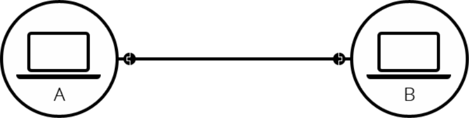
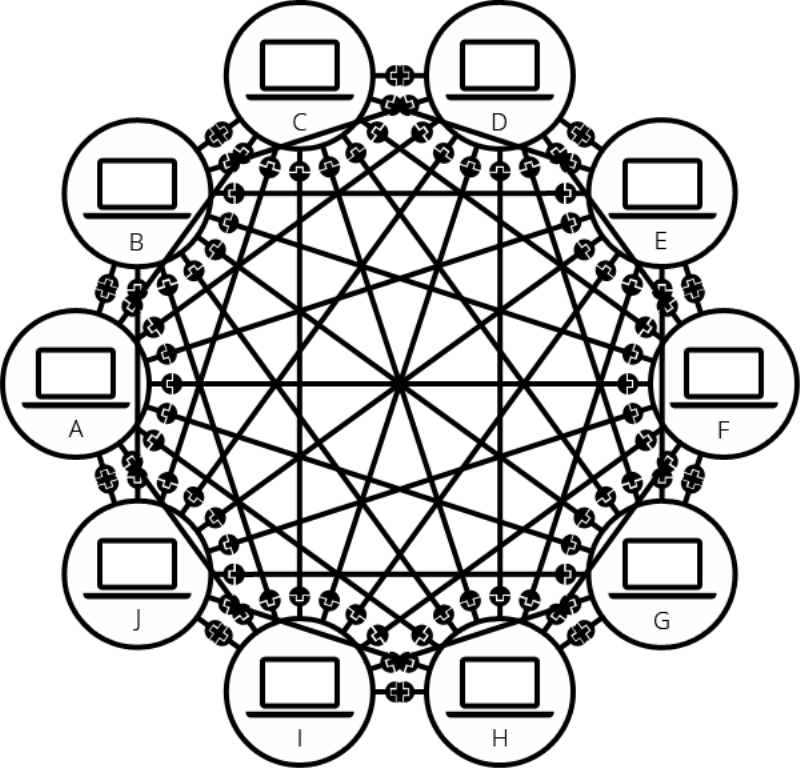
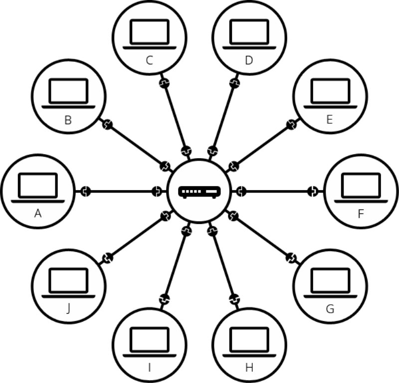
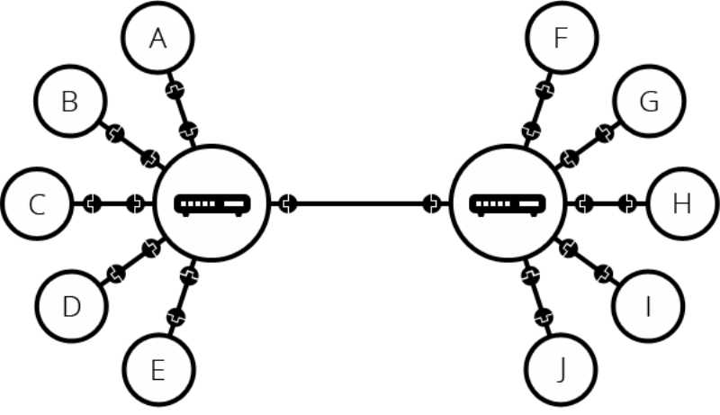
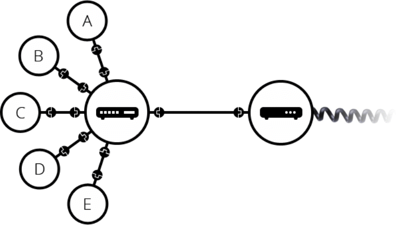
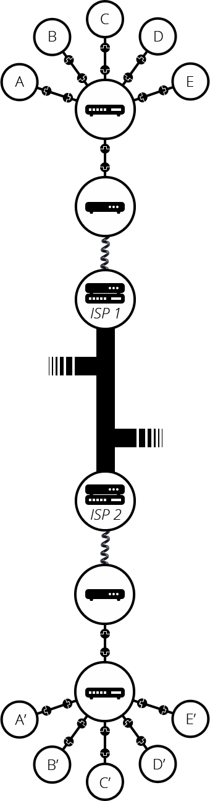

## 인터넷이란?
* 인터넷(Internet) 이란 정보를 담고 있는 각 컴퓨터들을 TCP/IP 라는 통신 프로토콜을 이용해 서로 정보를 주고 받도록 한 컴퓨터 네트워크를 말합니다.

## TCP/IP
* TCP/IP가 나타난 이유는 먼저 컴퓨터간의 통신을 위해서입니다.
* TCP = 전송 제어 프로토콜(Transmission Control Protocol, TCP), 컴퓨터에서 실행되는 프로그램 간에 일련의 데이터를 안정적으로 순서대로 에러없이 데이터를 교환할 수 있게 합니다.
* IP = 인터넷 프로토콜(Internet Protocol, IP), 네크워크 상에서 컴퓨터가 가지는 고유한 주소
* 프로토콜 = 프로토콜은 컴퓨터 내부에서, 또는 컴퓨터 사이에서 데이터의 교환 방식을 정의하는 규칙 체계입니다. 
기기 간 통신은 교환되는 데이터의 형식에 대해 상호 합의를 요구합니다. 
이런 형식을 정의하는 규칙의 집합을 프로토콜이라고 합니다.

## 두개의 컴퓨터간의 통신

* 두 대의 컴퓨터가 통신이 필요할 때, 우리는 다른 컴퓨터와 물리적으로 (보통 이더넷 케이블, 일반적으로 우리가 말하는 '랜선') 또는 무선으로 (WIFI or Bluetooth) 연결되어야 합니다.
* 모든 현대 컴퓨터들은 이러한 연결 중 하나를 이용하여 연결해야만 통신할 수 있습니다.
* 두대의 컴퓨터를 연결한다면 이러한 모습이며, 이러한 네트워크는 두 대의 컴퓨터로 제한되지 않습니다.

## 여러대의 네트워크

* 앞서 말했듯이 네트워크 연결은 2대의 컴퓨터로 제한되지 않습니다. 이와 같은 방식으로 원하는 만큼 컴퓨터를 연결할 수 있습니다. 하지만 이렇게 계속해서 연결할 경우 빠르게 복잡성이 늘어납니다.
* 예를들어 10대의 컴퓨터를 연결하려는 경우라면 컴퓨터당 9개의 플러그와 45개의 케이블이 필요합니다.

## 라우터를 이용한 네트워크

* 이 문제를 해결하기 위해 나온 것이 라우터입니다.
* 각 컴퓨터는 라우터라는 특수한 소형컴퓨터에 연결됩니다.
* 라우터는 데이터를 원하는 컴퓨터한테 잘 전달해주는 작업만 합니다.
* 예를들면 컴퓨터 A가 B로 메세지를 보내려면, A는 메세지를 라우터로 보내고, 라우터는 메세지를 B에게 보내도록, 그리고 C에게 보내지 않도록 합니다.
* 라우터를 시스템에 추가하면 10대의 컴퓨터 네트워크에는 10개의 케이블만이 필요합니다.

## 라우터와 라우터 연결을 통한 네트워크 속의 네트워크

* 라우터 그 자체도 컴퓨터이기에 라우터와 라우터를 연결하여 두 개의 네트워크를 연결합니다.
* 네트워크의 네트워크를 구현하여 모든 컴퓨터를 하나의 통신망으로 연결하는 것이 인터넷입니다.
* 하지만 아주 먼곳까지 계속해서 라우터를 유선 케이블로 연결 하는 것은 비효율적입니다.

## 모뎀을 이용한 네트워크

* 이 문제를 해결한 방법은 바로 기존의 모든 집에 연결된 케이블인 전화선을 이용하는 방법입니다.
* 전화 기반 시설은 세계 어느 곳과도 연결이 되어있으므로 네트워크는 구성이 되어있었습니다.
* 네트워크와 전화시설을 연결하기 위해서 모뎀(MODEM, MOdulator and DEModulator) 이라는 특수 장비가 필요합니다.
* 모뎀은 우리 네트워크의 정보를 전화 시설에서 처리 할 수 있는 정보로 바꾸고 그 반대의 경우도 마찬가지입니다.
* 모뎀을 통해 우리의 네트워크는 전화 시설에 연결됩니다. 하지만, 아직까지 우리의 컴퓨터가 보낸 메시지가 도달해야 할 컴퓨터(혹은 네트워크)까지 도달하지 않은 상태입니다.

* 이 메시지가 주고받기 위해서는 네트워크를 인터넷 서비스 제공업체 ISP(Internet Service Provider)에 연결합니다. 
* ISP는 모두 함께 연결되는 몇몇 특수한 라우터를 관리하고 다른 ISP의 라우터에도 액세스를 할 수 있는 회사입니다. ISP는 한국에서는 LG U+, KT, SKT등이 있습니다.
* 따라서 우리 네트워크의 메시지는 ISP 네트워크의 네트워크를 통해 대상 네트워크로 전달됩니다. 인터넷은 아래 그림과 같이 이러한 전체 네트워크 인프라로 구성됩니다.

## 요약
* 인터넷은 정보를 담은 각 컴퓨터를 TCP/IP 통신 프로토콜을 이용하여 연결하여 서로 정보를 주고 받도록 한 컴퓨터 네트워크 이다.
* 컴퓨터와 컴퓨터를 케이블 또는 무선 연결
* 개수가 많아지면 복잡하여 라우터 등장
* 단일 라우터로만으로도 몇백, 몇천대 연결은 불가능하여 라우터와 라우터를 연결
* 거리가 먼 지역은 케이블과 무선으로 연결이 불가능 그래서 내트워크의 정보를 전화 시설에 처리 할 수있는 모뎀이 나옴
* 네트워크에서 도달하려는 네트워크로 데이터를 보내기위해 ISP에 연결
* 컴퓨터 - 라우터 - 모뎀 - 전화시설 - ISP - 전화시설 - 모뎀 - 라우터 - 컴퓨터

참고 : 

https://velog.io/@doomchit_3/Internet-internet-what-how-IMBETPY

https://development-crow.tistory.com/3
